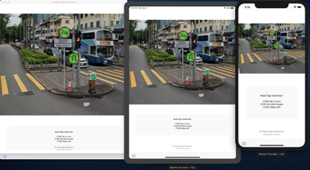
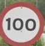

# HK Road Sign Detection
<b>Hong Kong Road Sign Detection for iOS / iPadOS / MacOS Application</b>

This application is an iOS / iPadOS / MacOS application that detects the road sign of Hong Kong from an image (only 12 Type of Available Detected Road Sign now)

Mac, iPad, iPhone screen capture (from left to right) 

This application used Object Detector task of Create ML. The model is exported to Core ML mlmodel file. The model is deployed to an iOS application.

<b>Functions: </b>

1.	Image select from library or take picture for machine learning task. 
2.	Detect the road signs using Core ML. 
3.	Draw a bouncing box on the raw video and present the result on the screen. 
4.	Detect 12 different road sign in the image to Notify the driver by highlighting important alert (i.e., Give Way, Speed limit).
5.	Use Mac Catalyst to show iPad app on Mac

<b>12 Type of Available Detected Road Sign</b>
 
| Road Sign Name | Road Sign Image |
| ------------- | ------------- |
| No entry	  |   |
| Keep left	   |   |
| Give Way	  |   |
| Pedestrians on road ahead	 	   |   |
| No learner drivers	  |   |
| Motorway begins	   |   |
| No U-turn	  |   |
| No mini-buses	   |   |
| 100 - Maximum speed	  |   |
| Speed Camera	   |   |
| No Stopping		  |   |
| One Way Traffic	   |   |
